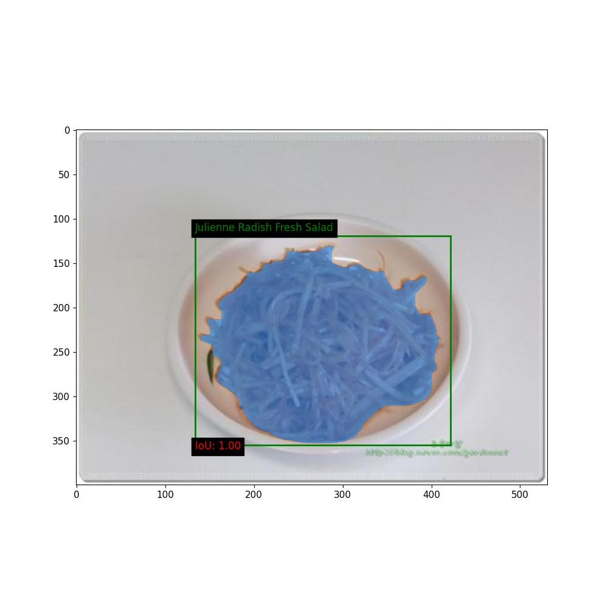
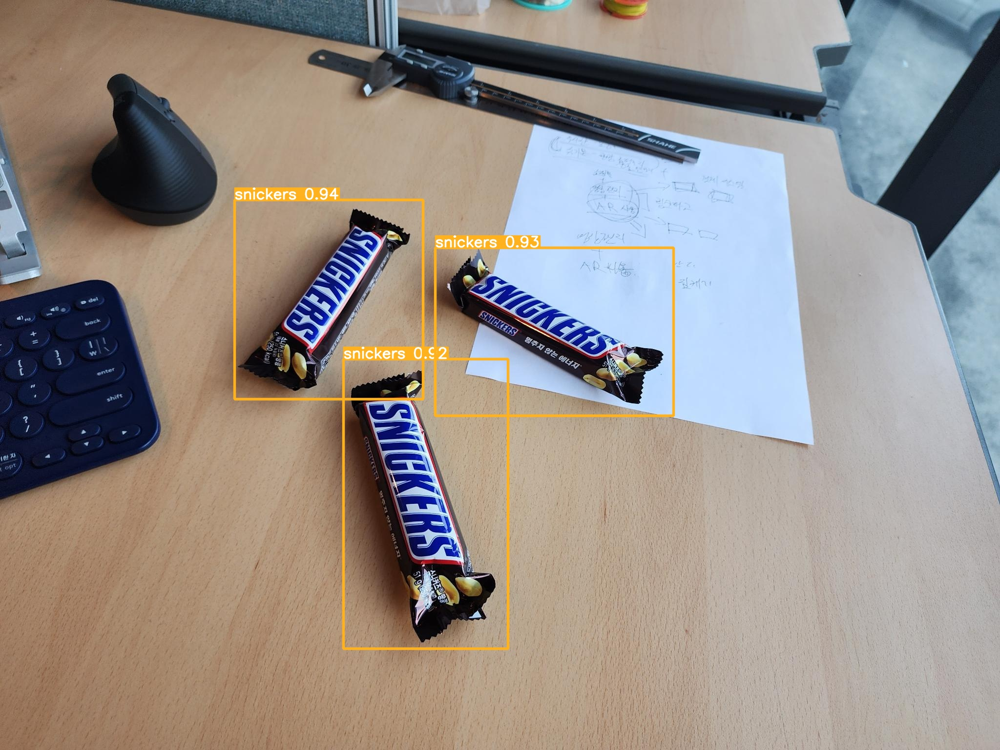

# Fseg-app - Solution for Food Detection, Segmentation, and Nutrition Value Calculation

## Table of Contents
- [Description](#description)
- [Features](#features)
- [Installation](#installation)
- [Usage](#usage)
- [Example](#example)
- [Contributing](#contributing)
- [License](#license)

## Description

The challenge at hand is to develop a comprehensive solution for automating the detection, segmentation, and classification of food items within images, and subsequently calculating their nutrition values.

## Features

Our proposed solution is a multi-step process that involves utilizing computer vision techniques and deep learning models to achieve accurate food detection, segmentation, and nutrition value calculation.

### Step 1: Food Type Detection and Classification

Once the plate is identified, we move on to the crucial task of food type detection and classification. For this purpose, we employ the YOLO (You Only Look Once) algorithm, a deep learning model renowned for its real-time object detection capabilities. YOLO accurately identifies and classifies different food items present on the plate, providing a detailed inventory of the meal composition.

### Step 2: Food Area Segmentation

Moving forward from food type detection, our solution integrates the cutting-edge SAM (Segment Anything) model developed by Meta. SAM is an open-source framework renowned for its exceptional object segmentation capabilities. The unique advantage of SAM is that it doesn't necessitate manual annotations of specific objects, in this case, food items. The model is pre-trained and is designed to work across diverse scenarios, making it an ideal fit for our segmentation needs.

By employing SAM, we can accurately segment the food areas within the bounding boxes obtained from Step 2. This segmentation process effectively separates each food item from its surroundings, regardless of the variations in shape, size, or appearance. SAM's proficiency in handling complex and varied object structures enhances the precision of our solution.

### Step 3: Packaged Food Detection and Classification

For this purpose, we employ the YOLO (You Only Look Once) algorithm, a deep learning model renowned for its real-time object detection capabilities. YOLO accurately identifies and classifies different packaged food items present near the plate.

### Step 4: Nutrition Value Calculation

Using the pixel count of the segmentation mask and knowing the dimensions of the plate, we can calculate the exact area of each type of food. By referencing established nutritional databases, we assign caloric, macronutrient, and micronutrient values to every recognized food item. This step enables users to access detailed nutritional insights for informed dietary decisions.

## Installation

To get started with our project, follow these steps:

1. **Clone the Repository**: Start by cloning this GitHub repository to your local machine using the following command:

    ```bash
    git clone https://github.com/Esupartners/Fseg-app.git
    ```

2. **Navigate to the Project Directory**: Change your current directory to the project's root directory:

    ```bash
    cd FSeg-app
    ```

3. **Create a Conda Environment**: We recommend using [Anaconda](https://www.anaconda.com/) for managing Python environments. If you don't have Anaconda installed, you can download and install it from their website.

4. **Set Up the Conda Environment**: Create a Conda environment and install the required dependencies listed in the `environment.yml` file. This file specifies all the necessary packages and their versions for our project:

    ```bash
    conda env create -f environment.yml
    ```

   This command will create a Conda environment with the name specified in `environment.yml` and install all the required packages.

5. **Activate the Conda Environment**: Activate the Conda environment to work within it:

    ```bash
    conda activate FsegEnv
    ```


That's it! You've successfully set up the project on your local machine using Conda. 


## Usage

The main functionality is provided through the pipeline function in the main.py script. This function takes care of running the entire pipeline, including:
1. Detecting food items and their bounding boxes using YOLOv5.
2. Preparing image embeddings using a SAM model.
3. Detecting packaged food items and their bounding boxes using YOLOv5.
4. Generating masks for food items using the segmentation model.
5. Calculating the surface area of each food item to estimate its quantity.
6. Visualizing the results and saving the output image.

To use the pipeline, you can customize the **options** (**weights**,**weights_packagedfood** and **source**) in the main.py script by modifying the opt variable
# Example usage:
```bash
opt = {
"weights": "./PlateDetection/bestnewdataset.pt",
"weights_packagedfood": "./PlateDetection/best5food.pt",
"source": "./PlateDetection/data/images",
"data": "./PlateDetection/data/coco128.yaml",
"imgsz": (640, 640),
"conf_thres": 0.25,
"iou_thres": 0.45,
"max_det": 1000,
"device": "",
"view_img": False,
"save_txt": False,
"save_csv": False,
"save_conf": False,
"save_crop": False,
"nosave": False,
"classes": None,
"agnostic_nms": False,
"augment": False,
"visualize": False,
"update": False,
"project": "./FSeg-app/PlateDetection/runs/detect",
"name": "exp",
"exist_ok": False,
"line_thickness": 3,
"hide_labels": False,
"hide_conf": False,
"half": False,
"dnn": False,
"vid_stride": 1,
"segmentation_model_type": "vit_h",
"save": True
}
```
and then run:
  ```bash
    python main.py 
  ```
 **Options:**
- weights: Path to the YOLOv5 weights file for detecting food items.
- weights_packagedfood: Path to the YOLOv5 weights file for detecting packaged food items.
- source: Path to the input image.
- data: Path to the dataset configuration file (YAML) used for YOLOv5.
- imgsz: Tuple specifying the input image size for inference.
- conf_thres: Confidence threshold for YOLOv5 detections.
- iou_thres: IOU threshold for non-maximum suppression.
- max_det: Maximum number of detections per image.
- device: Device for running the inference (e.g., 'cuda' or 'cpu').
- view_img: Flag to display the results.
- save: Flag to save the results.
- save_txt: Flag to save results to text files.
- save_csv: Flag to save results in CSV format.
- save_conf: Flag to save confidences in --save-txt labels.
- save_crop: Flag to save cropped prediction boxes.
- nosave: Flag to disable saving images/videos.
- classes: Filter by class for YOLOv5 detections.
- agnostic_nms: Flag for class-agnostic non-maximum suppression.
- augment: Flag for augmented inference.
- visualize: Flag to visualize features.
- update: Flag to update all models.
- project: Path to the directory for saving results.
- name: Name for saving results.
- exist_ok: Flag for allowing existing project/name (do not increment).
- line_thickness: Bounding box thickness in pixels.
- hide_labels: Flag to hide labels in the visualization.
- hide_conf: Flag to hide confidences in the visualization.
- half: Flag to use FP16 half-precision inference.
- dnn: Flag to use OpenCV DNN for ONNX inference.
- vid_stride: Video frame-rate stride.


That's it! You've successfully used our project to perform food detection on your test image.


## Example

Here's an example image generated by our food detection pipeline:
- For food detection:
<div style="text-align:center">
  
</div>

Console output as a dictionnary with food types and their respective pixel count : {'Julienne Radish Fresh Salad': 41331}

In this image, you can see the detections of various food items, each outlined by bounding boxes and labeled with their respective names and confidence scores.

- For packaged food detection:
<div style="text-align:center">
  
</div>

This example demonstrates the visual output produced by our pipeline. The actual output may vary depending on the test image and model used.

## Contributing

## License

